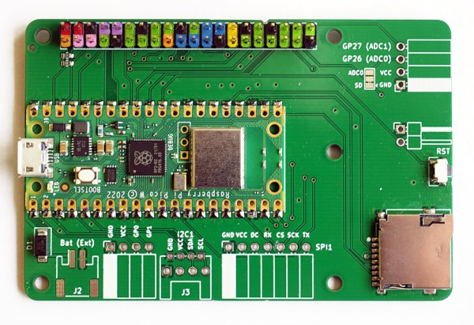
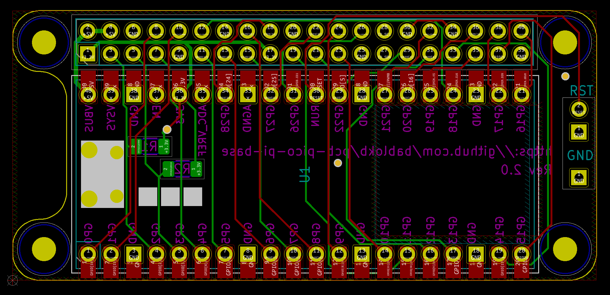
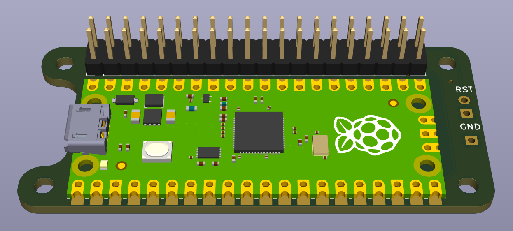
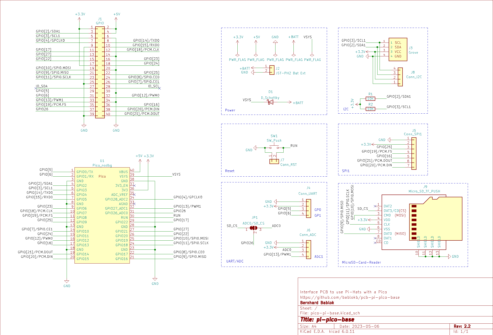
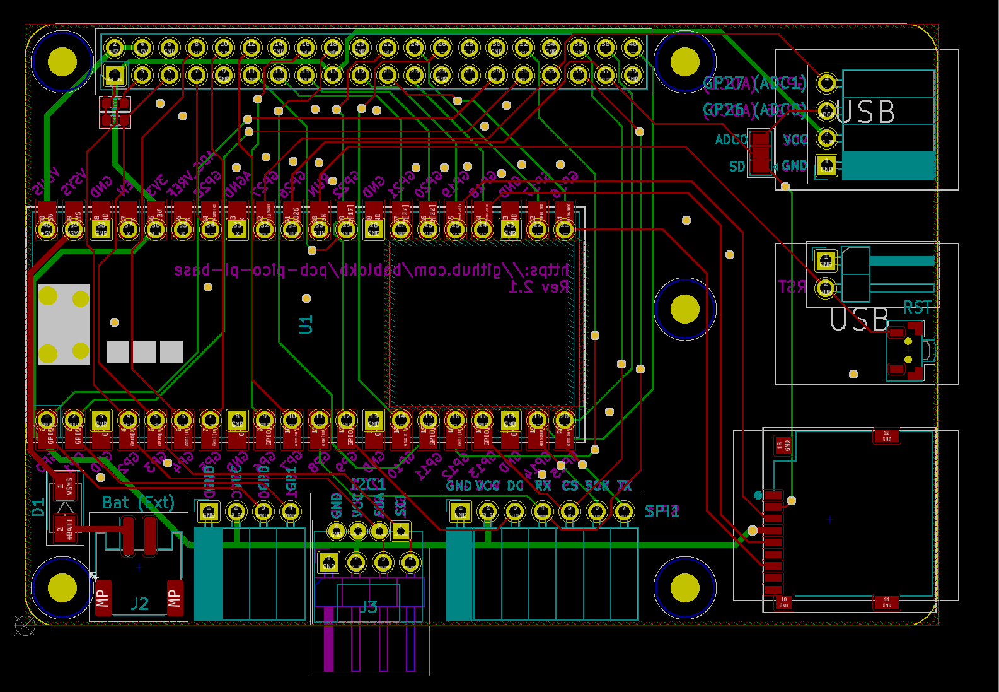
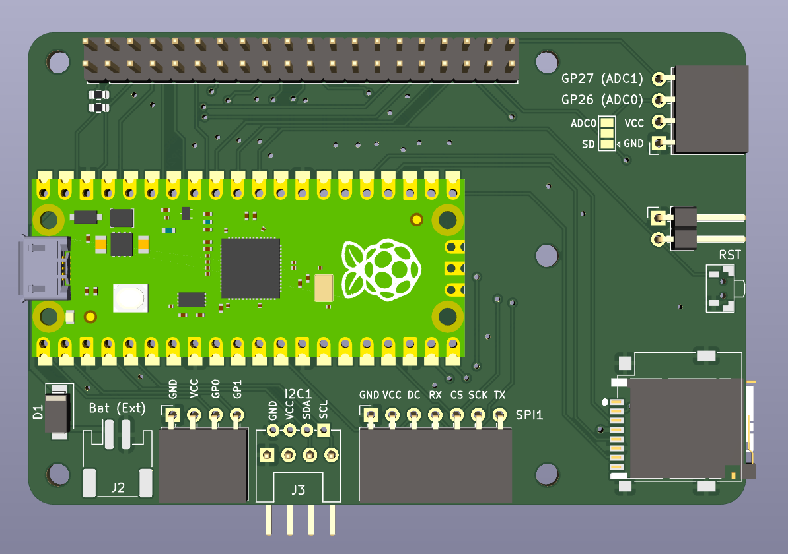
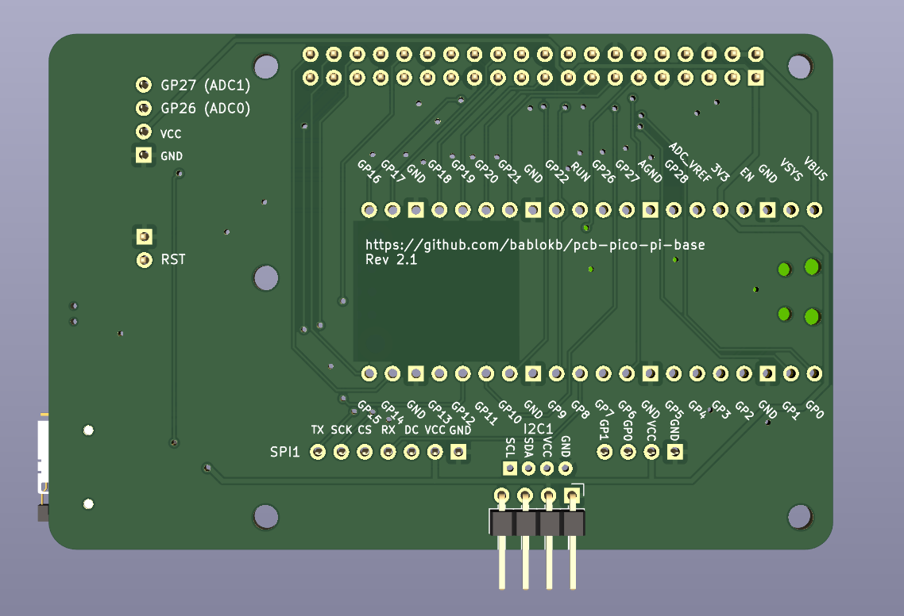

pcb-pico-pi-base
================

This projects provides two adapter-boards to run Pi-hats with a Pico.

The "pico-zero-base":

and the "pico-pi-base":

Hardware
--------

KiCad design-files are in `pico-zero-base.kicad` and in `pico-pi-base.kicad`
respectively. Ready to upload production files for JLCPCB are in `production_files`.

Except for I2C-pullups (and VSYS-diode on pico-pi-base) the adapter-boards
only map the pins of the Pico to pins of the Pi. The current version only
supports I2C, SPI0 and SPI1. I2S will be supported by the next version of
pico-pi-base. The smaller board won't support I2S due to space limitations.

Schematic, layout and 3D-rendered images for pico-zero-base:

Schematic, layout and 3D-rendered images for pico-pi-base:

Software
--------

Since you cannot run Linux-software on the Pico, you need to check if there is a
Pico-driver available for your hats or adapt existing Pi drivers to the Pico. Since
many hats have python-drivers, this is not too difficult. Most hats use I2C and/or SPI.

*work in progress*

  - special CircuitPython builds with pin-aliases mapping the GPIOs of the Pi to the Pico
  - CircuitPython drivers for various hats
  - examples

License
-------

[![CC BY-SA 4.0][cc-by-sa-shield]][cc-by-sa]

This work is licensed under a
[Creative Commons Attribution-ShareAlike 4.0 International
License][cc-by-sa].

[![CC BY-SA 4.0][cc-by-sa-image]][cc-by-sa]

[cc-by-sa]: http://creativecommons.org/licenses/by-sa/4.0/
[cc-by-sa-image]: https://licensebuttons.net/l/by-sa/4.0/88x31.png
[cc-by-sa-shield]:
https://img.shields.io/badge/License-CC%20BY--SA%204.0-lightgrey.svg
