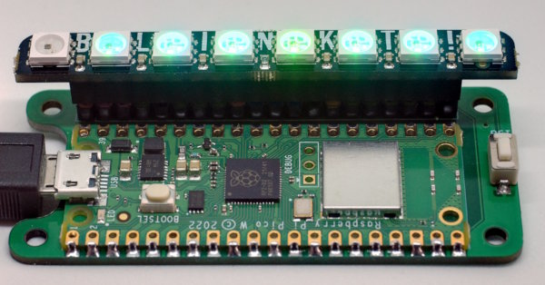
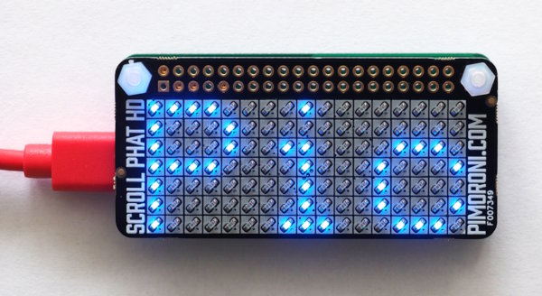
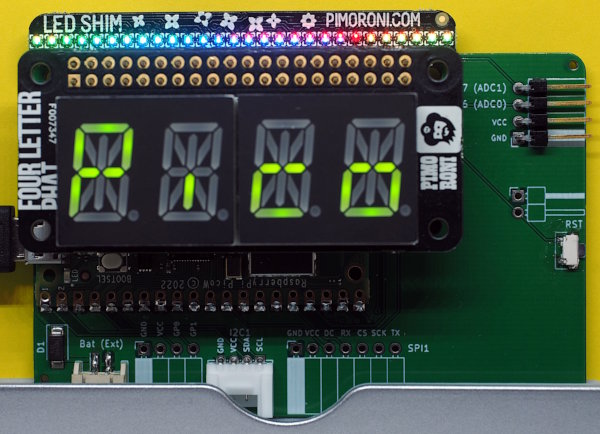

Examples
========

Some example programs for various hats. Check the `lib`-directory for
necessary (CircuitPython) drivers.

All the drivers assume that the mapping is done by the board-module.
E.g. the driver usesf `board.GPIO24` and this is then mapped automatically
to the correct `board.GPxx`.

Blinkt!
-------

This is a row of 8 APA102-LEDs with a connector. Simple and easy for nice
visual effects. It does not use I2C, but bit-banging with clock on GPIO24
and data on GPIO23. Porting was easy, replacing RPi.GPIO with digitalio.

Scroll pHat HD
--------------

Pimoroni's Scroll pHAT HD (now a retired product). Should also work
with the Scroll Hat Mini (<https://shop.pimoroni.com/products/scroll-hat-mini>).

A hat with 11x7 (monochrome) LEDs. The example is from
<http://github.com/adafruit/Adafruit_CircuitPython_IS31FL3731> and
uses the driver from that repo.

Touch pHat
----------

Pimoroni's Touch pHat <https://shop.pimoroni.com/products/touch-phat>.

The driver for the pHat and the CAP1166 chip were ported from the
Linux-version supplied by Pimoroni.

4-Letter pHat
-------------

A 4x14 segment display pHat <https://shop.pimoroni.com/products/four-letter-phat>.

Works out of the box with <http://github.com/adafruit/Adafruit_CircuitPython_HT16K33>.

LED-Shim
--------

Also from Pimoroni <https://shop.pimoroni.com/products/led-shim>. You can see
it above the 4-letter pHat in the image above.

Same driver as the scroll pHat: <http://github.com/adafruit/Adafruit_CircuitPython_IS31FL3731>. The example is from that repo too.

Button-Shim
-----------

A small pcb with five buttons and a RGB-LED from Pimoroni:
<https://shop.pimoroni.com/products/button-shim>.

Pirate-Audio Speaker-Hat
------------------------

A hat from Pimoroni with a 240x240 display, four buttons, an audio DAC and
a small speaker (https://shop.pimoroni.com/products/pirate-audio-mini-speaker).

There are a few variants of this head available and all should work the same.

Currently with Rev1-boards, only the display and the buttons are supported.
Rev2-boards will also (hopefully) support audio.

Adafruit Speaker-Bonnet
-----------------------

An audio hat with connectors for speakers, see
<https://www.adafruit.com/product/3346>.

This bonnet uses I2S and works without any additional libraries.
The example is from the guide
<https://learn.adafruit.com/adafruit-speaker-bonnet-for-raspberry-pi>. If you
compare the many pages of install instructions necessary to get this
working for a Pi you really love the simplicity of CircuitPython.

Display-Otron-Hat
-----------------

From Pimoroni: <https://shop.pimoroni.com/products/display-o-tron-hat>.

The hat has a 3x16 character LCD with RGB backlight, six bar-graph
LEDs and six touch-buttons.

Fully supported, but the examples need some minor tweaks.

InkyImpression 5.7"
-------------------

This 7-color e-ink display is from Pimoroni:
<https://shop.pimoroni.com/products/inky-impression-5-7>

It is the same display as used in the InkyFrame 5.7", which has a Pico-W
attached. Main difference is that the latter also has a RTC and
some sophisticated power-management circuit.

The InkyImpression works out of the box with the SPD1656-driver from
Adafruit <http://github.com/adafruit/Adafruit_CircuitPython_SPD1656>.

